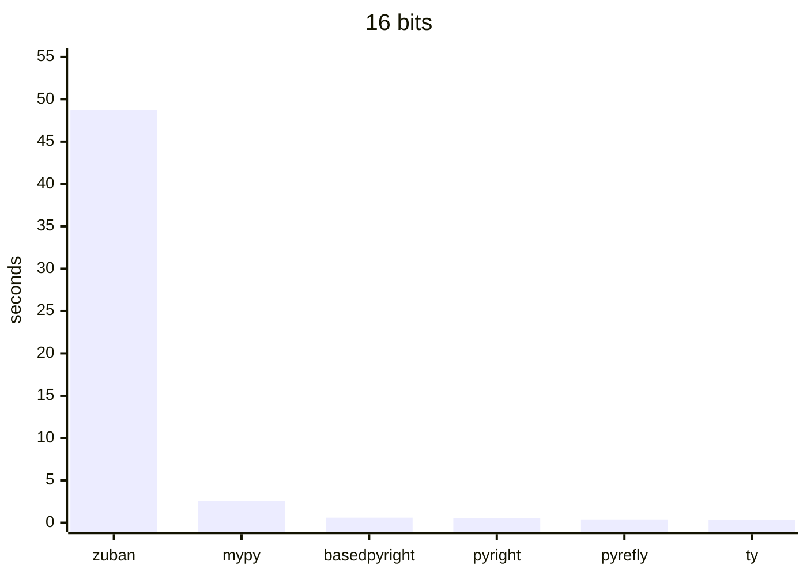
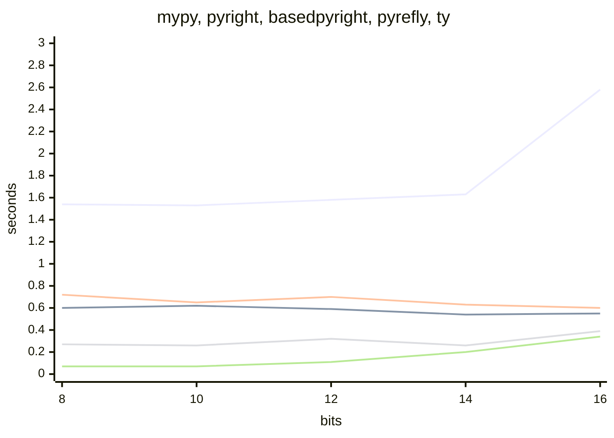
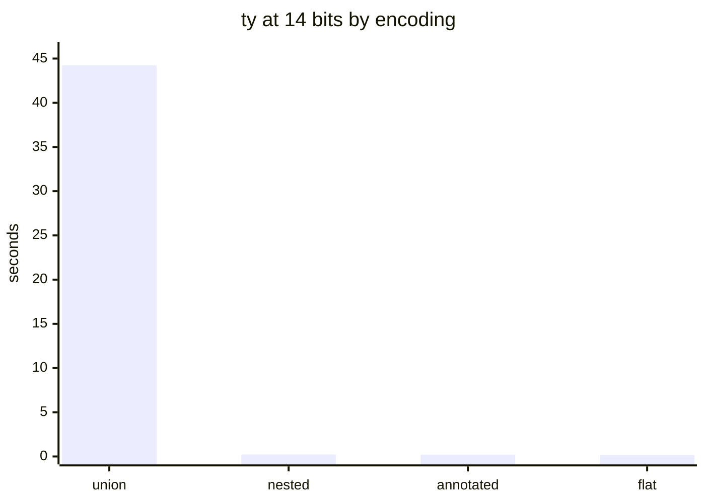

# types-bits

`u1`..`u10` and `i1`..`i10` as fully materialized `Literal` unions. Generated `.pyi`, zero
runtime cost, exhaustively checked.

```python
from typing import TYPE_CHECKING

if TYPE_CHECKING:
    from types_bits import u4

x: u4 = 15  # ok
y: u4 = 16  # error, on every checker
```

`camas` runs the gate; `camas --list` enumerates it. CI fans the same tree out over a
runner axis, with both matrix axes emitted from `tasks.py`. `camas bench` and
`camas bench_shapes` regenerate everything below into `bench/results/`.

## Runtime cost

Zero. The stub is a [PEP 484][pep484] `.pyi` behind `TYPE_CHECKING`. `import types_bits`
loads two modules and no stdlib (`tests/test_runtime.py`). Every number below is
type-checker wall clock, per check run.

## Check cost by width

Seconds, cold, best of one, Python 3.14.1 / WSL2. Encoding `flat`
(`uN: TypeAlias = Literal[0, ..., 2**N-1]`), declaring `u1..uN` (so a probe at N bits holds 2^(N+1)-2 literals) and widening each
into the next.

| bits | mypy | pyright | basedpyright | ty | pyrefly | zuban |
|---:|---:|---:|---:|---:|---:|---:|
| 8 | 1.54 | 0.60 | 0.72 | 0.07 | 0.27 | 0.10 |
| 10 | 1.53 | 0.62 | 0.65 | 0.07 | 0.26 | 0.11 |
| 12 | 1.58 | 0.59 | 0.70 | 0.11 | 0.32 | 0.28 |
| 14 | 1.63 | 0.54 | 0.63 | 0.20 | 0.26 | 3.25 |
| 16 | 2.58 | 0.55 | 0.60 | 0.34 | 0.39 | 48.73 |

Shipped library (`u1..u10` + `i1..i10`): mypy 1.51, basedpyright 1.28,
pyright 1.08, pyrefly 0.23, zuban 0.08, ty 0.06 — matching the `uN: TypeAlias = int` control.


```mermaid
xychart-beta
    title "16 bits"
    x-axis [zuban, mypy, basedpyright, pyright, pyrefly, ty]
    y-axis "seconds" 0 --> 55
    bar [48.73, 2.58, 0.60, 0.55, 0.39, 0.34]
```

zuban, same sweep — 12x then 15x per extra 2 bits past 12:

```mermaid
xychart-beta
    title "zuban vs width"
    x-axis "bits" [8, 10, 12, 14, 16]
    y-axis "seconds" 0 --> 55
    line [0.10, 0.11, 0.28, 3.25, 48.73]
```

The other five, 0–3s axis. Rising line is mypy; flat cluster is pyright, basedpyright,
pyrefly, ty:


```mermaid
xychart-beta
    title "mypy, pyright, basedpyright, pyrefly, ty"
    x-axis "bits" [8, 10, 12, 14, 16]
    y-axis "seconds" 0 --> 3
    line [1.54, 1.53, 1.58, 1.63, 2.58]
    line [0.60, 0.62, 0.59, 0.54, 0.55]
    line [0.72, 0.65, 0.70, 0.63, 0.60]
    line [0.27, 0.26, 0.32, 0.26, 0.39]
    line [0.07, 0.07, 0.11, 0.20, 0.34]
```

## Fixed vs marginal cost

`u(N-1)` and `u(N)` declared in every row; only the use count varies. Italic rows are the
`uN: TypeAlias = int` control.

10 bits — indistinguishable from `int`:

| uses | mypy | pyright | basedpyright | ty | pyrefly | zuban |
|---|---:|---:|---:|---:|---:|---:|
| declared, unused | 1.23 | 0.48 | 0.64 | 0.03 | 0.22 | 0.07 |
| *control* | *1.39* | *0.48* | *0.65* | *0.06* | *0.22* | *0.08* |
| 1 widening | 1.24 | 0.51 | 0.60 | 0.05 | 0.22 | 0.10 |
| 10 widenings | 1.20 | 0.53 | 0.59 | 0.07 | 0.25 | 0.16 |

16 bits — 98,304 literals:

| uses | mypy | pyright | basedpyright | ty | pyrefly | zuban |
|---|---:|---:|---:|---:|---:|---:|
| declared, unused | 2.01 | 0.53 | 0.57 | 0.22 | 0.29 | 0.20 |
| *control* | *1.19* | *0.47* | *0.55* | *0.05* | *0.21* | *0.08* |
| 1 assignment | 1.96 | 0.56 | 0.61 | 0.21 | 0.33 | 0.21 |
| 1 widening | 1.94 | 0.52 | 0.60 | 0.21 | 0.28 | **34.90** |
| 10 widenings | 2.19 | 0.56 | 0.65 | 0.26 | 0.29 | **timeout (>180s)** |

- Declaration: fixed per check run, ~linear in literals (~8 µs/literal on mypy). Not per
  importing file, not per use.
- Assignment: free. Enumerated membership is a hash lookup.
- Widening: free except zuban at width.

## Widening

Cost tracks the *narrow* operand, not the wide one. Wide side fixed at `u16`, one widening:

| narrow | zuban | mypy | ty |
|---|---:|---:|---:|
| u1 | 0.18 | 2.54 | 0.20 |
| u4 | 0.18 | 2.46 | 0.15 |
| u8 | 0.16 | 2.67 | 0.21 |
| u12 | 0.76 | 2.50 | 0.17 |
| u15 | 35.21 | 2.80 | 0.18 |

*Measured under the PEP 695 spelling; no task reproduces this sweep.*

Both operands must be large. At the 10-bit ceiling the worst case (`u9` → `u10`) is 0.10s.
Annotating a boundary at one width, so callers assign literals rather than widen between
adjacent wide aliases, avoids the shape entirely.

## Encodings

| encoding | form | result |
|---|---|---|
| `flat` | `Literal[0, ..., 2**N-1]` | shipped; fastest, portable |
| `nested` | `Literal[u9, 512, ...]` | legal per [PEP 586][pep586]; pyrefly rejects past ~10 levels (`Invalid type inside literal, int`, 1 error at 10 bits → 7 at 16), ty at 16 |
| `union` | `u9 \| Literal[512, ...]` | ty 44.24s at 14 bits vs 0.17s flat |
| `annotated` | `Annotated[Literal[...], Ge, Le]` | tracks `flat` within noise to 14 bits |
| `opaque` | `int` | control |

*Measured under the PEP 695 spelling, before the [PEP 613][pep613] switch; `camas bench_full`
regenerates.*


```mermaid
xychart-beta
    title "ty at 14 bits by encoding"
    x-axis [union, nested, annotated, flat]
    y-axis "seconds" 0 --> 46
    bar [44.24, 0.23, 0.22, 0.17]
```

## Runtime tier

[PEP 562][pep562] module `__getattr__` resolves the same names to
`Annotated[int, Ge(lo), Le(hi)]` ([PEP 593][pep593]), the shape
[`annotated-types`][at] consumers read. `tests/test_runtime.py` pins it against the static
bounds for all 20 widths. Needs the `rt` extra; `annotated_types` imports on first
attribute access.

```python
from pydantic import TypeAdapter
from types_bits import u8  # Annotated[int, Ge(0), Le(255)] at runtime

TypeAdapter(u8).validate_python(256)  # ValidationError
```

## Prior art

[`range-typed-integers`][rti] defines `u8 = NewType('u8', Annotated[int, ValueRange(0, 255)])`
for the byte widths `u8`..`u64` / `i8`..`i64`.

| | range-typed-integers | types-bits |
|---|---|---|
| carrier | `NewType` over `Annotated[int, ValueRange]` | `Literal` enumeration |
| bound enforced by | runtime `u8_checked()` / `check_int()`, raising `IntegerBoundError` | the type checker |
| `a: u8 = 12` | mypy error — `int` is not `u8`; requires `u8(12)` | ok |
| `a: u8 = 900` | mypy error, *identical* to the line above | error, and distinguished |
| `u8(900)` | accepted statically | n/a |
| widths | u8..u64 | u1..u10 |

Verified against every checker in the gate: mypy reports the same `Incompatible types in assignment
(expression has type "int", variable has type "u8")` on the in-range and out-of-range
lines alike. The range is metadata no checker reads ([PEP 746][pep746] would not change
this). `ValueRange` is O(1) per type, so it reaches u64; enumeration is O(2^N), so it
stops at u10.

## PEPs

No PEP provides bounded integers.

| PEP | Status | Relevance |
|---|---|---|
| [586 – Literal Types][pep586] | Final | The mechanism. Calls `Literal` insufficient for numpy-style numeric code and defers integer generics. Permits the `nested` form pyrefly rejects. |
| [593 – `Annotated`][pep593] | Final | Metadata channel for the runtime tier. |
| [613 – Explicit Type Aliases][pep613] | Final | `uN: TypeAlias = ...` in the stub; why the floor is 3.10. |
| [695 – Type Parameter Syntax][pep695] | Final | `type uN = ...` reads better, but mypy rejects a `type` statement under `--python-version 3.11` — fatally, `errors prevented further checking` — so it would pin the floor at 3.12. The other five accept it at a 3.10 target. |
| [561 – Packaging Type Information][pep561] | Final | `py.typed`; why the stub ships in the wheel. |
| [562 – Module `__getattr__`][pep562] | Final | One name, two tiers. |
| [649][pep649] / [749][pep749] – Deferred Annotations | Final (3.14) | Guarded import gets cheaper. |
| [746 – Type checking `Annotated` metadata][pep746] | Draft, targets 3.15 | Lets a checker verify metadata suits its type. Does not make any checker enforce `Ge`/`Le`. |

- [python/typing#554, "Support for Range Types?"][i554] — closed. Requested an Ada-style
  `RangeType`.
- [discuss.python.org, "Use type hinting with bound constraints, e.g. `int[0:15]`"][thread]
  — no resolution. Objections: most constraints are not statically validatable; ranges need
  new type-system machinery; arithmetic is not closed. Landed on `Annotated` +
  `annotated-types` with runtime validation.

`fixtures/reject.py` covers the arithmetic case: every checker rejects `u4 + u4` where a
`u4` is required. mypy widens the sum to `int`; ty and zuban widen it to `Literal[0, ..., 30]`.

[pep484]: https://peps.python.org/pep-0484/
[pep561]: https://peps.python.org/pep-0561/
[pep562]: https://peps.python.org/pep-0562/
[pep586]: https://peps.python.org/pep-0586/
[pep593]: https://peps.python.org/pep-0593/
[pep613]: https://peps.python.org/pep-0613/
[pep649]: https://peps.python.org/pep-0649/
[pep695]: https://peps.python.org/pep-0695/
[pep746]: https://peps.python.org/pep-0746/
[pep749]: https://peps.python.org/pep-0749/
[at]: https://github.com/annotated-types/annotated-types
[i554]: https://github.com/python/typing/issues/554
[thread]: https://discuss.python.org/t/use-type-hinting-with-bound-constraints-e-g-int-0-15/38820
[rti]: https://github.com/theCapypara/range-typed-integers
